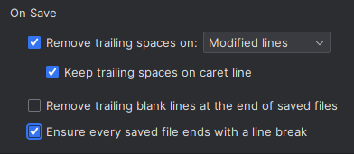
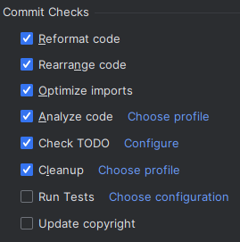

# Development reference

이 문서에서는 프로젝트 설정 방법을 설명합니다.

## 시작하기

프로젝트는 자바 스프링 부트와 Gradle을 사용하는 애플리케이션입니다. 에디터는 **IntelliJ IDEA**를 사용합니다.

테스트 및 실행을 위해서는 **Redis**, **MariaDB**, **H2 db**가 설치되어 있어야 합니다.

1. 필요한 디펜던시를 설치합니다. IntelliJ에서 `build.gradle` 파일을 여는 것으로 충분합니다.
2. `/src/main/resources/application-secret.example.yaml`을 참고하여 같은 경로에 `application-secret.yaml` 파일을 생성합니다.
3. 이제 `OotdzipApplication`을 실행하면 됩니다!

## 개발 환경 설정

이 프로젝트에서는 **CheckStyle**을 사용하여 코드를 검사합니다. 모든 설정은 IntelliJ를 기준으로 작성되었습니다.
[네이버 핵데이 Java 컨벤션](https://github.com/naver/hackday-conventions-java)를 사용합니다.

### CheckStyle Plugin 설정

- **Settings** - **Plugins** - **Marketplace**에서 **CheckStyle-IDEA** 플러그인을 설치합니다.
- **Settings** - **Tools** - **CheckStyle**로 이동합니다.
- **Scan Scope**를 `All sources (including tests)`로 변경합니다.
- **Configuration File** - `+` 를 누르고 다음과 같이 설정합니다.

  
- `suppressionFile` 속성을 `naver-checkstyle-suppressions.xml`로 설정합니다.
- 추가한 파일를 체크하고 저장합니다.

### Editorconfig 설정

- 이 프로젝트에서는 빠르게 설정을 적용할 수 있도록 `.editorconfig` 파일을 사용합니다.
- **Settings** - **Editor** - **Code Style**에서 **Enable EditorConfig Support**를 체크하고 저장합니다.
- 마지막으로 `.editorconfig` 파일을 열면 설정이 적용됩니다.

### IntelliJ 추가 설정

- 이 프로젝트에서는 파일의 끝에 단 하나의 줄바꿈 문자를 사용합니다.
- **Settings** - **Editor** - **General**로 이동합니다.
- 가장 아래의 **On Save**에서 아래 항목을 다음과 같이 체크합니다.

  

### Pre commit 검사 설정

- **Settings** - **Version Control** - **Commit**으로 이동합니다.
- **Commit Checks**에서 **Reformat Code**, **Rearrange Code**, **Optimize Imports** 등을 체크하고 저장합니다.

  